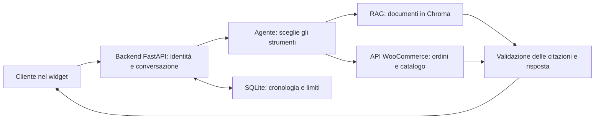

# Traccia per la presentazione — woo-rag-assistant

Bozza aggiornata al 29 settembre 2026. Riferimento applicativo: commit `15b617a`.
Da aggiornare con l'evoluzione del progetto; durata e formato della presentazione
non sono ancora definiti. La scaletta propone circa 10 minuti, demo compresa.

## 1. Il problema e l'obiettivo (1 minuto)

Un cliente di un e-commerce può chiedere informazioni generali, come la policy
di reso, oppure dati personali aggiornati, come lo stato del proprio ordine.
Una risposta utile deve scegliere la fonte corretta e rispettare l'identità
del cliente.

Il progetto è un assistente per WooCommerce, incorporabile nel negozio con un
widget. Consulta documenti e API del negozio e può combinare le due fonti.
La prima versione è di sola lettura: non modifica ordini e non emette rimborsi.

Frase di apertura possibile:

> Ho costruito un assistente che risponde sulle informazioni del negozio e sui
> dati del cliente, distinguendo le fonti documentali dai dati aggiornati e
> imponendo i controlli di accesso nel backend.

Il beneficio atteso è facilitare l'accesso alle informazioni di assistenza.
Non abbiamo ancora misurato una riduzione dei ticket o dei tempi del personale.

## 2. Come funziona (2 minuti)

Prima della chat, l'ingestion legge prodotti e pagine Woo/WordPress, divide i
testi in passaggi, calcola gli embedding e costruisce una versione della knowledge
base. La versione candidata viene verificata prima di diventare attiva; è previsto
il rollback alla precedente.

Durante la chat:

1. Il backend identifica la sessione e recupera la sua conversazione.
2. Il modello sceglie fra ricerca documentale, strumenti WooCommerce o entrambi.
3. Gli strumenti eseguono le operazioni consentite e restituiscono i dati.
4. Il backend verifica gli ID delle citazioni contro i passaggi recuperati nel
   turno corrente e salva lo scambio completato.

Esempio centrale: «Posso restituire il mio ordine?». Servono la policy dal RAG
e la data di consegna verificata dal tool ordini. Se la consegna non è disponibile,
l'assistente non può stabilire con certezza la scadenza.

## 3. Le scelte da saper spiegare (2 minuti)

| Scelta | Motivazione e limite |
| --- | --- |
| Documenti nel RAG, ordini e disponibilità nelle API | Le informazioni dinamiche vanno consultate al momento della domanda. |
| Autorizzazione nel codice | Il modello non può decidere a quali ordini accedere; i tool ordini sono assenti per gli ospiti e filtrati per cliente. |
| Citazioni con ID del passaggio | Possiamo verificare la provenienza della fonte; questo controllo da solo non prova la verità di ogni frase. |
| Astensione e fallback distinti | Informazione non trovata e servizio temporaneamente indisponibile richiedono risposte diverse. |
| Limiti a turni, contesto e tentativi | Evitano cicli e richieste senza controllo; il budget in token non è un tetto monetario esatto. |
| SQLite per le conversazioni | Consente la ripresa dopo riavvio del backend senza un nuovo servizio; il deployment resta a singolo worker. |
| Ricerca ibrida opzionale | È già implementata; attivarla richiede un confronto sul corpus, non basta che sia una tecnica più avanzata. |

### Il contributo della lezione 12

La lezione riunisce chat con memoria persistente, documenti propri, strumenti sui
dati e valutazione con domande note. Nel progetto ingestion, RAG, tool e valutazione
erano già presenti. L'integrazione ha aggiunto la persistenza SQLite e il volume
Docker `conversation_state`, mantenendo owner, scadenza, turni e limiti della history.
Le API WooCommerce svolgono il ruolo delle tabelle SQL del laboratorio.

La ripresa richiede lo stesso token/cookie valido e lo stesso ID conversazione.
Il widget conserva il proprio stato in memoria: ricaricare la pagina o cambiare
sessione avvia ancora una nuova chat. Il TTL predefinito è di 30 minuti dalla
creazione, non dall'ultimo messaggio.

## 4. La demo da preparare (3 minuti)

| Passo | Domanda o azione | Cosa mostrare |
| --- | --- | --- |
| 1 | Ospite: «Quanto costa la spedizione standard?» | Risposta documentale e collegamento alla fonte. |
| 2 | Ospite: «Dov'è il mio ordine?» | Invito ad accedere; nessun tool ordini disponibile. |
| 3 | Cliente demo: stato di un suo ordine, poi un ordine dell'altro cliente | Consultazione consentita e risposta «ordine non trovato» per l'altro cliente. |
| 4 | Cliente demo: «Posso ancora restituire questo ordine?» | Uso congiunto di policy e dati; eventuale astensione se manca la consegna. |
| 5 | Pagina aperta: riavvio del backend, poi domanda di follow-up | Ripresa della stessa history dopo riavvio; da provare in Docker prima di presentarla. |

Prima della presentazione controllare gli ID effettivi degli ordini, le fonti e
le risposte attese. Le finestre di reso dipendono dalla data: un esempio valido oggi
potrebbe dare correttamente una risposta diversa fra qualche mese. Configurare la
demo di login solo nell'ambiente di sviluppo. Fare riferimento ai comandi di
[avvio e demo nel README](../README.md#avvio).

Preparare una registrazione o schermate di una prova riuscita come supporto alla
demo, indicando data e versione. Una prova con provider vero richiede autorizzazione
per dati e costi; non è stata eseguita durante la preparazione di questa traccia.

## 5. Risultati verificati e limiti (2 minuti)

| Evidenza | Cosa possiamo sostenere |
| --- | --- |
| Integrazione lezione 12, commit `15b617a`: 62 test offline mirati e lint superati | Store SQLite e API verificati con riapertura dello store/lifespan, follow-up, identità, limiti e scrittura fallita; provider sostituiti nei test. |
| [Report issue 7](issue-7-results.md), versione precedente `18ff205` | Documenta 226 test e prove Docker isolate su ingestion e deployment. Sono risultati storici, non una nuova esecuzione sull'ultima versione. |
| Golden dataset: 30 casi, con runner e confronto baseline | Esiste una procedura per confrontare routing, fonti, risposte e regressioni. I risultati con modello simulato verificano il software, non l'accuratezza di un LLM reale. |

I 62 test sono una selezione mirata, non si sommano ai 226 del report precedente.
La nuova persistenza non è ancora stata verificata con un riavvio reale del container
in questa sessione. Il [report issue 6](issue-6-results.md) descrive il vecchio store
volatile: le sue aspettative sul riavvio sono storiche e vanno aggiornate nel relativo
harness prima di usarlo per validare la nuova versione.

Limiti da dichiarare: login WooCommerce reale ancora da integrare; widget senza
ripresa dopo reload; un solo worker; cronologia su disco non cifrata; qualità delle
risposte e costi live da misurare. Non presentare percentuali offline come accuratezza
generale o tempi sintetici come latenza reale per il cliente.

## Miglioramenti candidati e quando farli

Questa è una lista di priorità, non di funzionalità già implementate.

| Priorità | Intervento | Criterio di completamento |
| --- | --- | --- |
| Prima della prossima demo | Aggiornare il test Docker sul riavvio per lo store persistente | Stessa sessione + ID recuperano la history; altra sessione e conversazione scaduta restano escluse, anche dopo ricreazione del container con lo stesso volume. |
| Prima di dichiarare la qualità | Eseguire un confronto live autorizzato su domande rappresentative, comprese ambiguità e follow-up | Risposte attese, ripetizioni, correttezza, fonti, astensioni, latenza e consumo riportati con modello e versione. |
| Se serve continuità durante la navigazione | Riprendere la chat dopo reload del browser | Ripristino autorizzato della conversazione; logout e cambio cliente isolano i dati. Progettare la sessione senza salvare token sensibili in localStorage. |
| Prima di usare ordini reali | Collegare il login reale del negozio | Identità verificata end-to-end e test di isolamento fra clienti. |
| Quando le misure mostrano errori di retrieval | Confrontare semantic e hybrid; valutare reranking | Miglioramento sullo stesso dataset senza regressioni rilevanti e con costi/tempi accettabili. |

Le prossime lezioni possono suggerire soluzioni a questi problemi. Per ogni nuova
tecnica: individuare un caso che oggi fallisce, riusare il codice esistente,
confrontare prima/dopo e aggiornare questa traccia. Non serve riscrivere il progetto
a ogni lezione o aggiungere agenti, servizi e dipendenze senza un'esigenza misurata.

## Domande possibili durante la presentazione

- **Perché non basta interrogare il modello?** Le policy devono essere collegate
  alle fonti del negozio e ordini/stock richiedono dati aggiornati e autorizzati.
- **Come impedisci di leggere gli ordini altrui?** Identità risolta nel backend,
  toolset condizionale e filtri per cliente, indipendenti dal prompt.
- **Come sai che la risposta è corretta?** Verifica delle fonti e confronto con
  risposte attese; la provenienza di una citazione non basta a garantire ogni frase.
- **Perché non hai cambiato framework con la lezione 12?** Il loop già presente
  copriva orchestrazione e strumenti; il requisito mancante era la persistenza.
- **È pronto per la produzione?** È un project work con controlli e prove
  riproducibili; autenticazione reale, valutazione live e requisiti operativi del
  negozio restano passaggi da completare.

## Come tenere aggiornata la traccia

Dopo una modifica importante annotare: problema iniziale, decisione, commit,
verifica eseguita, risultato e limite residuo. Prima dell'esame concordare durata
e criteri richiesti, scegliere pochi esempi solidi e trasformare questa bozza
nelle slide definitive.

Approfondimenti: [README](../README.md), [decisioni architetturali](architecture.md),
[valutazione](../evals/README.md), [ingestion e deployment](ingestion-deployment.md).
